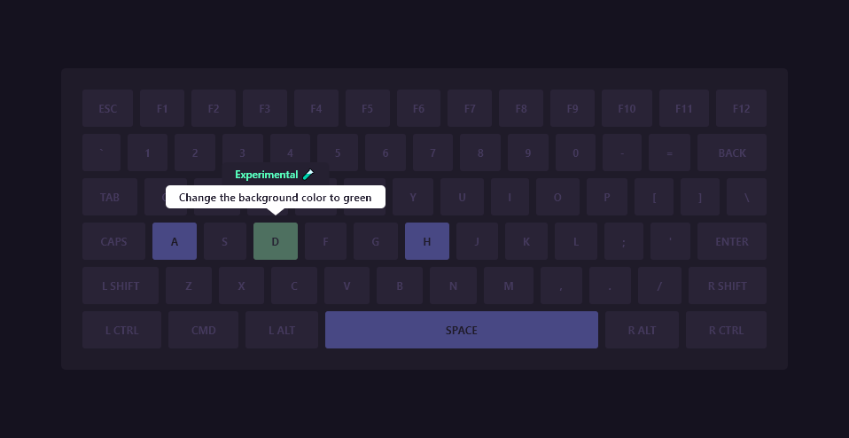

# hotkeys

hotkeys module in TypeScript for easy to add hotkeys

##### Example



##### Requirements

- get `hotkeys.css` and `hotkeys.ts`

##### Usage

load the css into html `head` tag

```html
<link rel="stylesheet" href="hotkeys.css">
```

initialization

```typescript
import { Hotkeys } from "./hotkeys.ts";

let hotkeys = new Hotkeys();
```

create a hotkey

```typescript
hotkeys.set({
	key: "h",
	short: "Toggle Hotkeys",
	long: "Toggle the hotkeys modal display",
	func: () => hotkeys.toggle_modal(),
	experimental: false,
});
```

remove a hotkey

```typescript
hotkeys.remove("h");
```

display keys names available

```typescript
for (const row of Hotkeys.KEYBOARD_KEYS) {
	for (const column of row) {
		console.log(column);
	}
}
```
